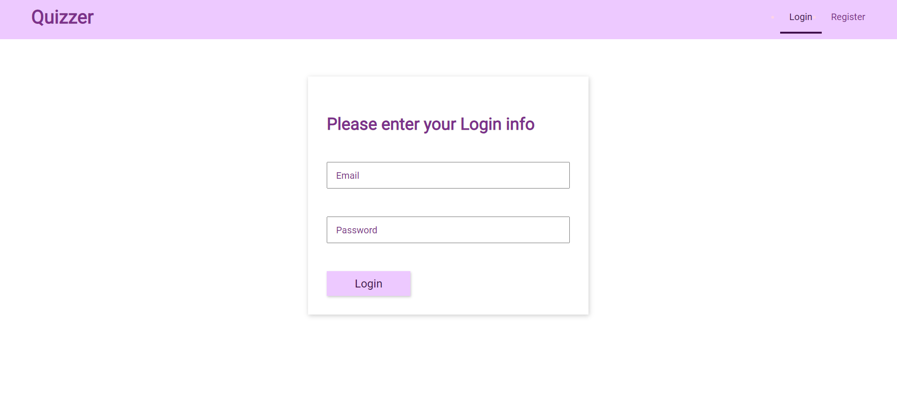
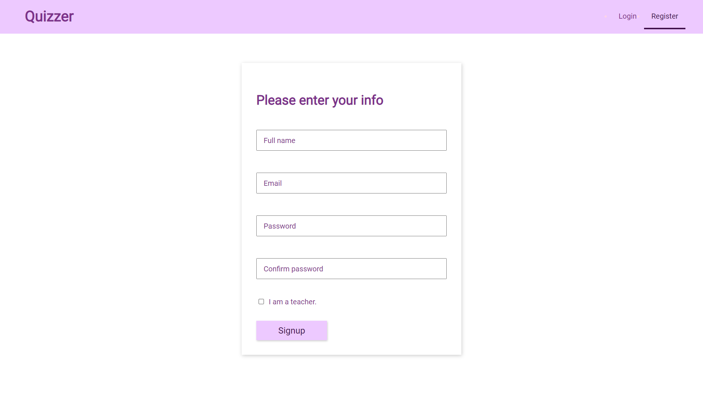
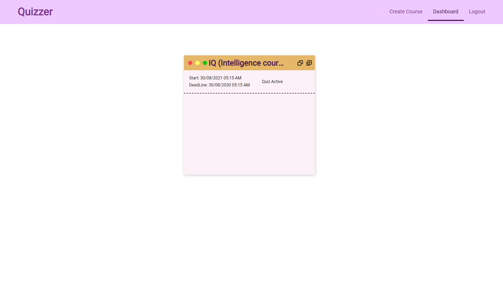

<h1>Quizzer</h1>

Please visit this live link: <a href="https://quizzer-2600.web.app/">https://quizzer-2600.web.app/</a>

If you signed up as a student, please use this course code 607bGrcbm5ObngiskcU3 to enroll to your first course.

<h2>About Project</h2>

  This is an app for educational facilities that allows teachers to create a course and build a quiz for the course.
  Students can enroll to the course using the course id supplied by their teacher. They can also take the quiz and get a
  grade.

The app isn't build for production, but instead it's just a personal project build for learning purposes and fun.

<h3>Technologies used:</h3>

<ul>
  <li>React using CRA</li>
  <li>CSS Modules.</li>
  <li>React Context for state management.</li>
  <li>Firebase.</li>
  <li>Tinymce text editor.</li>
</ul>

<h3>Project Thumbnails</h3>

Login

Signup

Teachers Dashboard

<h2>How to build locally ?</h2>

<ol>
  Clone or this repository
</ol>
<ol>
  open src/firebase and add your own firebase api key and database url
</ol>
<ol>
  Run
  <code>npm start</code>
</ol>
